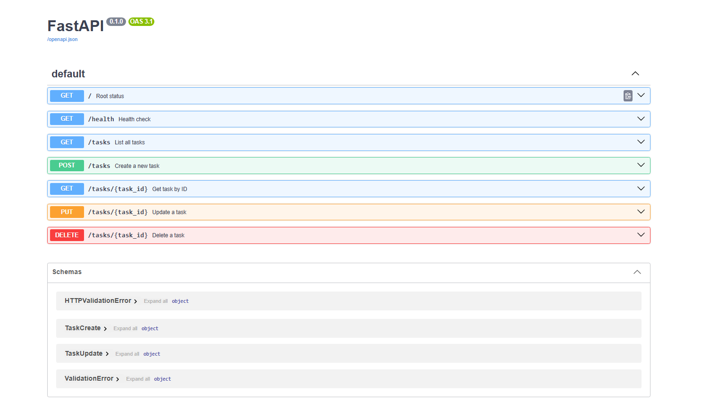

# Task API

A simple CRUD REST API built with FastAPI for managing a to-do list. Tasks are stored in memory (no database) — data resets when the server restarts.

## How to run

```bash
pip install fastapi "uvicorn[standard]"
fastapi dev main.py
```

Server runs at `http://localhost:8000`. Interactive docs at `http://localhost:8000/docs`.

## Endpoints

| Method | Path            | Description                     |
|--------|-----------------|----------------------------------|
| GET    | `/`             | API info and available endpoints |
| GET    | `/health`       | Health check                     |
| GET    | `/tasks`        | List all tasks                   |
| GET    | `/tasks/{id}`   | Get a single task by id          |
| POST   | `/tasks`        | Create a new task                |
| PUT    | `/tasks/{id}`   | Update a task's title and/or done status |
| DELETE | `/tasks/{id}`   | Delete a task                    |

## Example request
curl.exe -i -X POST http://localhost:8000/tasks -H "Content-Type: application/json" -d '{\"title\": \"Buy milk\"}'

HTTP/1.1 201 Created
date: Wed, 07 Oct 2026 20:16:42 GMT
server: uvicorn
content-length: 40
content-type: application/json

{"id":4,"title":"Buy milk","done":false}

## Swagger UI



PEACE!